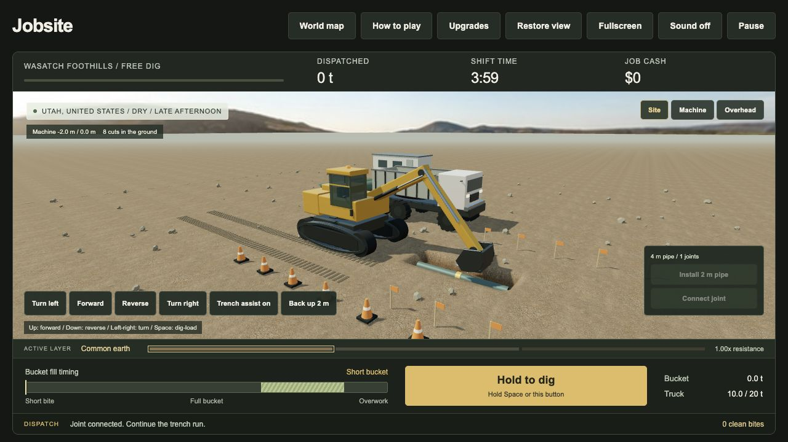

# Jobsite

A browser construction game from [openmud](https://openmud.ai). Build a campus from sitework through commissioning, or dispatch an autonomous utility spread. Choose a region, operate an excavator, take a utility line from excavation to inspected pipe, compacted backfill, and handover. Or explore the site freely with an excavator, trucks, and a pipe crew.

**[Play Jobsite](https://openmud.ai/jobsite)** · **[How to play](https://openmud.ai/jobsite#how-to-play)** · **[Report an issue](https://github.com/masonearl/jobsite/issues)**



This is an early, playable prototype. The source is MIT licensed. Contributions from operators, construction professionals, artists, and developers are welcome.

## Play locally

Clone the project and serve the `web` folder with Python 3:

```sh
git clone https://github.com/masonearl/jobsite.git
cd jobsite
python3 -m http.server 8000 --directory web
```

Open **http://localhost:8000**. Use an HTTP server rather than opening the HTML file directly: the game loads JavaScript modules and map data. A browser with WebGL is required.

There is no build step, account, API key, backend service, or package install needed to play. Three.js is included locally. This standalone edition does not include the parent site's analytics or navigation scripts.

## Build a construction campaign

Open **Build the whole project** on the main screen, or [play construction campaigns](https://openmud.ai/jobsite-projects). Choose from Stratos in Utah, Stargate in Abilene, Saline and Doña Ana County, AWS New Carlisle, Terafab in Grimes County, or a Starbase civil expansion.

Each scenario has 24 dependency-linked work packages across two structures and their support infrastructure. Dispatch all crews once, order long-lead packages, and run the project. Survey, earthwork, utilities, concrete, steel, electrical, mechanical, fit-out and commissioning teams operate autonomously. Cranes, access equipment, concrete pumps and other spreads are shared. Waiting reasons expose the bottleneck. Prioritize work, add capacity, expedite deliveries, or demobilize finished trades to reduce payroll. Formation, pre-energization and handover require explicit inspection release.

The 3D campus gains foundations, structural bays, enclosure, plant equipment and fit-out as work advances. Use **Roof off** to inspect internal services and racks. Terafab replaces data-hall fit-out with process utilities, cleanrooms and tool installation. Starbase has a pad, tower and integration building; it does not simulate rocket operations. Regional ground and repeating weather presets change outdoor productivity and crane availability.

Challenge targets and a completion score reward schedule and cost performance. The guide explains the sequence. Map, guide, tab hiding and reload pause the project. P pauses; repeated Space input is not needed. Each destination has a separate device save under `openmud-jobsite-campus-v1:`. These saves do not migrate or overwrite utility-line saves. Unsupported or unreadable campus saves are preserved, and another tab's write pauses conflicting saves. Export a JSON project record for comparison. A new attempt explicitly replaces only the selected campus save.

**Public facts vs game assumptions:** every project card links its primary source and gives the source date. These are representative construction phases, not surveyed replicas, complete project budgets, current progress feeds, or endorsed depictions. Abilene and Starbase already exist; their scenarios are fictional additional phases. Stratos is presented as a proposal. Layouts, 12 ha sitework quantities, labor counts, equipment groups, material allowances, durations and weather are game presets. Purchase packages are paid at order; labor and rentals accrue daily even when idle, plus $12,000/day site overhead. Model time is three seconds per scenario day at 1x. Real permits, curing, qualification and staffing are substantially simplified. Visible equipment and workers are representative, not one-to-one counts.

Campus source files are `web/jobsite-projects.html`, `jobsite-campus.js` (pure scheduler, catalogs, sources and save validation), `jobsite-campus-scene.js` (Three.js), `jobsite-campus-ui.js` (controls and persistence), and `jobsite-campus.css` under the corresponding assets folders. Rendering is capped at 30 fps and 1.25 device pixels per CSS pixel. No new runtime dependencies were added.

Run `npm test` for 108 simulation/save checks. With the QA server running, open `/__campus-check` for ten browser checks including a full build, inspection holds, pause, resource additions, map/save return and destination isolation. Add `?mobile` for an additional 390 px overflow check. `/__campus-check?preview&site=starbase&seed=complete` previews completed civil works; use `site=terafab` for the fab. Fixtures use memory storage and an accelerated local-only clock.

## Dispatch an autonomous utility spread

Choose a region and equipment spread, then select **Build a utility line**. Click **Start excavation**, **Start pipe crew**, and **Start backfill** to dispatch independent assignments. **Start whole spread** starts all three with one click. No held key is needed.

- The excavator tracks beside the trench, swings across to dig, retains a spoil bank and loads the haul truck. The truck hauls full loads and the final partial load automatically.
- The pipe crew follows completed excavation through pumping where required, formation checks, bedding, pipe placement, connection and pre-cover inspection.
- A separate backfill backhoe follows inspected pipe after at least 6 m has been excavated. It places four lifts, with compaction between lifts. Delivered selected fill surrounds the pipe; retained spoil supplies upper backfill.
- Work fronts wait for excavation, deliveries and crew separation. Excavation pauses at a 10 m open-trench limit until backfill catches up. These distances are game rules, not field specifications.
- Each **Stop** button finishes that gang's current operation before parking; other assignments continue. **Pause** freezes the entire shift immediately. Space optionally starts/stops the whole spread, and resumes a paused shift.

The dispatch board shows each gang's progress and waiting reason. Open **Crew & upgrades** in expanded view for inventory, deliveries, reused spoil, costs and field records. The final report counts 12 m of accepted line, six inspections and 24 compacted lifts. **Mobilize to site** retains the existing manual earthworks mode for spreads without an active utility project.

## Controls

- **Up:** drive forward toward the bucket. **Down:** reverse. Release to stop.
- **Left / Right:** turn the machine. Trench assist makes a quarter turn per press and stops cuts at the 0.90 m pipe bed; turn it off for free steering and deeper cuts.
- **Space:** start or resume, dig, load, and advance to the next cut. Hold Space or the gold button to keep working at 80% bucket capacity. Release in the marked zone for a full single bite and cash bonus. Tap during a cycle to queue one next action. Space clears crew stops and recovers blocked or parked trucks. Release stops repeating; the current action finishes. Space works across game toolbar controls; Enter activates the focused control. Text fields and the guide keep normal keyboard behavior.
- **Recovery:** blocked trucks move to a clear loading lane; a finished or obstructed cut advances to fresh ground. At the boundary, the spread relocates to a usable pad. Recovery preserves excavated terrain, installed pipe, payload and earnings. Repeated crew/truck overlaps trigger recovery after a bounded wait. Pausing, leaving the game or reloading clears queued input.
- **Back up 2 m:** move one pipe length in reverse while keeping the trench aligned.
- **Install 2 m pipe:** available after the bed is within the target depth tolerance and the bucket is empty. Install an adjoining section, then **Connect joint**.
- **Site plan:** show a saved pipe-corridor layout over the actual terrain. Planned, on-grade and installed sections have different colors. **Plan from bucket** aligns a new plan with the current machine heading.
- **Drag / scroll / pinch:** orbit and zoom the camera. Camera orientation does not change forward or reverse.
- **Expand game:** fill the browser viewport. **Fullscreen:** use native fullscreen where supported. **Esc:** exit the expanded view.
- **Clear crew:** park workers outside the equipment zone after pipe work. Workers stop nearby equipment; open cuts, exposed pipe and stored bundles stop a blocked truck. **Switch truck side** routes it beyond the existing trench to the other loading pad. **Cancel truck move** parks it if the route is blocked; reposition the spread, then call it again.
- **Crew & upgrades:** train spotting or machine operation, take lunch, and review saved crew levels.
- **Throttle:** three distinct 2 m sections on grade unlock Eco, Work and Boost RPM presets with different speeds and fuel use.
- **P:** pause when the game has keyboard focus. Opening the guide or map also pauses the shift.

Touch controls are available in the scene. In expanded view, open **Upgrades** for equipment purchases.

## What is implemented

- Six regional scenarios with different landscapes, materials, hauling times, and equipment presets.
- Independent excavation/haul, pipe and backfill assignments with shared terrain, spoil reuse, deliveries, inspections, compaction and handover.
- Three equipment spreads, three contracts per region, and free digging without a clock.
- Articulated equipment, a digging/loading cycle, trucks, and a visible pipe crew.
- Terrain deformation at each bucket location. Cuts and installed pipe remain as you move and carry into the next contract on that site.
- Trench alignment assistance, two-meter reversing, pipe joint connection and a saved site-plan overlay.
- Equipment upgrades, foreman/operator/laborer/joiner levels 1–10, training and lunch breaks.
- Geometry-based excavation volume, density-based mass accounting and truck capacity limits.
- Equipment/worker interlocks, persistent trench and pipe obstacles, and device saves.
- A construction learning guide and fullscreen controls.

The regions are illustrative presets with generated environments. Terrain, capacities, time, and prices are simplified game values, not surveyed conditions, estimating data, or equipment training. Each region and fleet keeps its own local device save, including active excavation, pipes, vehicles, cash, upgrades, crew skills, fuel, shift history and utility-project progress. Autonomous utility projects use version 3 saves. Version 1 earthworks and version 2 utility saves remain readable; unfinished utility jobs migrate while preserving active work and resources. Reloaded shifts resume paused. Changing shifts preserves the work. Saves include a previous-good backup; unsupported saves are retained, and stale tabs cannot overwrite a newer saved job. Saves stay in this browser profile and do not sync between devices.

## Development

Run the simulation checks with Node.js 22 or later:

```sh
npm test
```

To check the browser input path, run `python3 scripts/serve-jobsite-input-check.py` and open `http://127.0.0.1:4181/__input-check`. Select **Run input checks**. These eleven real-page checks cover saved-site Resume, sustained Space past pipe grade, repeat and release, toolbar focus, guide/world return, typing, crew drills, queued taps, blocked trucks, crew stops and ended shifts. Timed holds use synthetic keyboard events. The fixture uses in-memory saves and does not modify your browser's saved jobs. Open `http://127.0.0.1:4181/__project-check` for seven additional browser checks covering one-click dispatch, independent assignments, stops, pause, guide/map return, a full autonomous handover, concurrent save/resume and legacy migration. Add `?mobile` to preview a 390 px game frame. The full-project browser check uses a local-only 12x simulation clock. Also check physical Space keypresses after Resume and fullscreen in your target browser.

- `web/index.html`: game and learning guide.
- `web/assets/js/jobsite-sim.js`: deterministic production, movement, terrain, and pipe-work state.
- `web/assets/js/jobsite-scene.js`: Three.js equipment, terrain, crew, lighting, and camera.
- `web/assets/js/jobsite-save.js`: versioned sparse terrain saves, validation, backups and cross-tab protection.
- `web/assets/js/jobsite.js`: browser controls, screens, audio, and persistence.
- `web/assets/css/jobsite.css`: responsive UI.
- `tests/jobsite-sim.test.js`: simulation and construction-flow checks.
- `tests/jobsite-flow.test.js`: autonomous crew overlap, independent stops, open-trench limits, spoil accounting, all region/fleet combinations and v2/v3 save migration.
- `tests/jobsite-project.test.js`: all 18 region/fleet combinations, material and terrain balances, stage prerequisites, pumping, deliveries, work methods and save/resume.
- `tests/jobsite-save.test.js`: save validation, backups and persistence regressions.

The live demo is hosted within openmud.ai; this repository is the standalone game. Static hosts can serve `web` as the site root. A Vercel configuration is included.

## Lightweight rendering and simulation

The renderer is Three.js r170, capped at 30 frames per second and one device pixel per CSS pixel, with a 1024-pixel shadow map. The 56 m terrain grid has 0.25 m spacing (50,625 vertices). Excavation updates only the affected vertices and nearby normals. Rendering stops when the page is hidden or the map/guide is open, and settled paused scenes draw only when needed. There is no physics engine or server simulation.

Worker zones and vehicle obstacles use simple geometric checks. Blocked trucks stop until the primary action requests recovery. Recovery is a short equipment reset, not a rigid-body rollover or tow simulation. Switching loading sides uses a route around the far end of existing excavation; it does not perform a full road-network route search. Utility projects restore the height field with bedding and compacted backfill lifts. Pipe displacement is deducted from fill quantities; imported fill and reused spoil are tracked separately; gross excavated volume and mass remain separate from the current open excavation. The pipe line uses a fixed corridor with work-front spacing, not a civil-design solver. The side excavator, haul truck and backfill backhoe follow scripted paths. Retained spoil is treated as suitable for upper fill in these presets; real soil acceptance is not simulated. Compaction uses prescribed passes rather than soil mechanics or field density tests. Machine capacity, density, fuel and time are explicit game presets. Bank volume is integrated from the height field; mass equals removed volume times the current bite density. Loose-volume swell is not modeled.

Performance depends on the GPU, browser and number of placed pipes. Operator notes show CPU render-submission time and draw calls; this does not measure GPU time or total browser memory. Device saves are subject to browser storage availability and limits.

## Help build it

Useful contributions include clearer equipment geometry and animations, better trench and material behavior, operator feedback on controls, accessibility, and performance on lower-powered devices. Please open an issue with a concrete example or a focused pull request. See [CONTRIBUTING.md](CONTRIBUTING.md).

## License and assets

Crew overhead tags are `F1` (foreman), `Operator 1`, `L1` (laborer), and `PJ1` (pipe joiner); the number tracks each role's trained level.

Code is [MIT licensed](LICENSE). Three.js and OrbitControls retain their [MIT license](web/assets/vendor/three/LICENSE). Natural Earth map data is public domain. Generated landscape and ground textures are included; their source notes and prompts are in [ASSETS.md](web/assets/jobsite/ASSETS.md).
